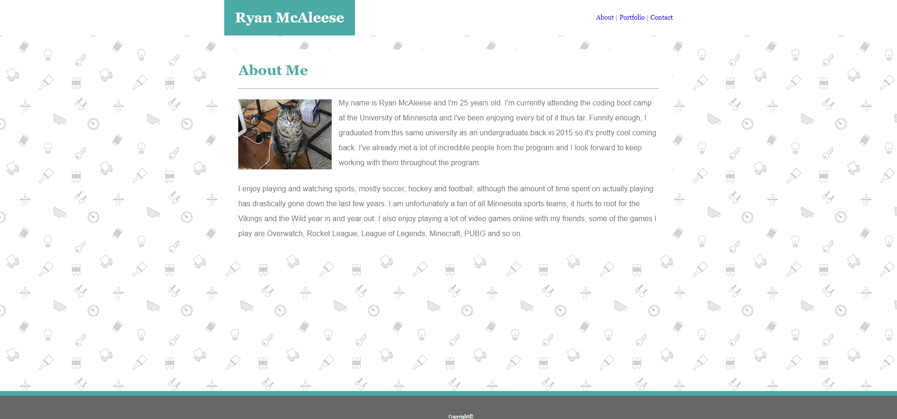
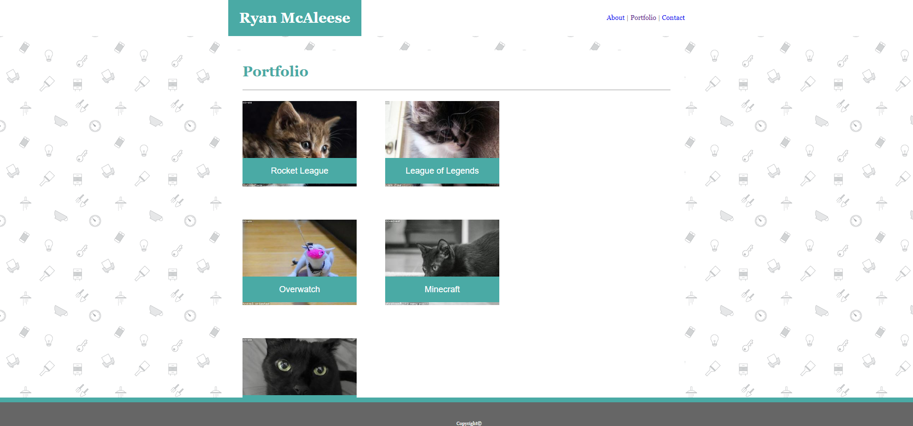
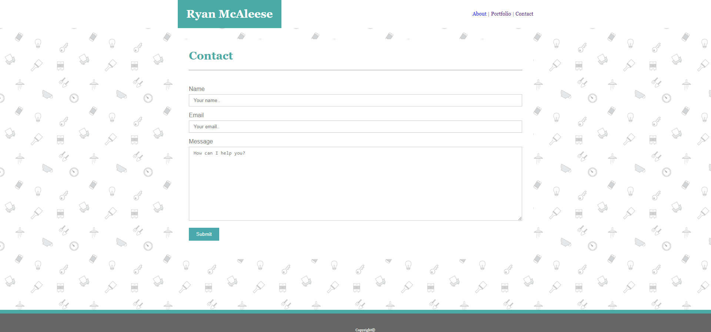

# Assignment 1 Basic Portfolio

This project is a very basic portfolio created in HTML and CSS. Pictures used in the portfolio are all lorem pixel images used as placeholders. Below are screenshots of each pages of the portfolio. Click **[here][1]** for live version of the portfolio.

- index.html

- portfolio.html

- contact.html

[1]: https://mcale017.github.io/Assignment-1-Basic-Portfolio/